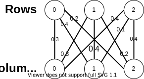
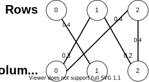
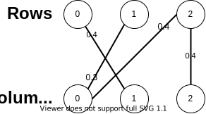

# Ghostbusters

Making a Forest with Disjoint Sets  
[The Problem](https://open.kattis.com/problems/ghostbusters2)

## <!-- omit in toc -->Contents

- [Modelling the problem](#modelling-the-problem)
- [Overview](#overview)
- [Constructing a Maximum Spanning Tree](#constructing-a-maximum-spanning-tree)
  - [Kruskal's Algorithm Pseudocode](#kruskals-algorithm-pseudocode)
  - [Disjoint Sets data structure](#disjoint-sets-data-structure)
- [Constructing the Signal Graph](#constructing-the-signal-graph)
- [Final Pseudocode](#final-pseudocode)

## Modelling the problem

We can model the keyboard as a [bipartite graph](https://en.wikipedia.org/wiki/Bipartite_graph) where each row and column is a vertex and keys are edges that connect a row with a column. Keys are weighted by their probability of being pressed.

The keyboard is a complete bipartite graph because it's rectangular (each row has a key for all columns). We can create a graph of the input signals for each row by only keeping the edges to the columns that received the signal.

### <!-- omit in toc -->Sample Input 2

```ruby
3 3
0.3 0.4 0.2
0.3 0.4 0.2
0.4 0.1 0.4
1 1
2 0 2
2 0 2
```

### <!-- omit in toc -->Complete Bipartite Graph



### <!-- omit in toc -->Signal Graph



Since the probability _p_ that a key is pressed is constrained by _0 < p < 0.5_, to maximize the overall probability of the graph we want to choose as few edges as possible and choose the edges with the greatest weight. A [tree](<https://en.wikipedia.org/wiki/Tree_(graph_theory)>) will connect vertices using minimal edges by eliminating cycles (which happen when multiple keys connect a row with a column). We can choose which edges to keep by always choosing the highest weight, making a [maximum spanning tree](https://en.wikipedia.org/wiki/Minimum_spanning_tree).

Notice, not all rows and columns are connected to each other; the problem's input specifies for each row, which columns the row is connected to (which columns received a signal). The graph may be disconnected, so we'll find a maximum spanning tree for each connected sub-graph, making a forest.

### <!-- omit in toc -->Maximal Forest



[back to top](#ghostbusters)

## Overview

The high-level steps we'll take to solve this problem are:

<!-- no toc -->
1. [Construct the signal graph](#constructing-the-signal-graph)
2. [Construct a maximum spanning tree for each connected sub-graph](#constructing-a-maximum-spanning-tree)
3. [Output the resulting forest](#final-pseudo-code)

I'll explain step 2 first, then go back to step 1.

## Constructing a Maximum Spanning Tree

There are many algorithms to construct a maximum/minimum spanning tree; I'll use [Kruskal's algorithm](https://en.wikipedia.org/wiki/Kruskal%27s_algorithm) because it's quick to code, and I think it's one of the more intuitive ones for this problem.

The way Kruskal's algorithm works is by claiming that the maximum weight edge in a graph _must_ be in the maximum spanning tree (MST). So add that edge to the MST and repeat until all edges are used. To prevent cycles, only add an edge to the MST if it connects two disconnected sub-graphs.

### Kruskal's Algorithm Pseudocode

```ruby
edges     # all edges in the graph
mst       # edges in the maximum spanning tree

edges = edges.sort()
for edge in edges
  if subgraph_of(edge.vertex_u) != subgraph_of(edge.vertex_v)
    mst.add(edge)
    union_subgraphs(edge.vertex_u, edge.vertex_v)
```

### Disjoint Sets data structure

We'll use a [disjoint sets data structure](https://en.wikipedia.org/wiki/Disjoint-set_data_structure) to keep track of which sub-graph each vertex belongs to. This type of data structure can keep track of disjoint sets and tell us what set an element is in. It also allows us to union two disjoint sets. The runtime for _n_ find and union operations is _O(n lg\*n)_ (n times log star n), which is pretty much linear time. Sorting the edges will dominate the algorithm's runtime, if we use a comparison-based sort.

We'll create a `vertex` class with two fields: `parent, rank`. Disjoint sets are represented by an arbitrary `vertex` that's a member of the set (its in the sub-graph). Every `vertex` in the same set will have the same representative. At the start of the algorithm, each `vertex` is in its own set and will have itself as its representative.

#### Parent

The `parent` field is used to find a vertex's representative (the representative will have `parent == self`). When we want to find the representative of a `vertex`, we can recursively find the representative of `vertex.parent` until `vertex.parent == vertex`. For efficiency, we'll compress the path to the representative for each `vertex` we traversed through by setting `parent = representative` (once the representative is found).

#### Rank

The `rank` field will keep the distance from the `parent` to the furthest child. When we union two sets, the representative with the lower `rank` will take on the other representative as its new `parent`, minimizing the rank of the union set's representative (which means the furthest child won't have to go as far to find its representative). If the two ranks are equal, then we have to increase the `rank` of the union set's representative by 1 (because the furthest child is now 1 more vertex away from its representative).

#### Disjoint Sets Pseudocode

```ruby
class Vertex
  parent, rank
  constructor()
    parent = self
    rank = 0

find_rep(vertex)
  if vertex != vertex.parent
    vertex.parent = find_rep(vertex.parent)
  return vertex.parent

union(vertex_v, vertex_u)
  vertex_v = find_rep(vertex_v)
  vertex_u = find_rep(vertex_u)
  if vertex_v != vertex_u
    if vertex_v.rank > vertex_u.rank
      vertex_u.parent = vertex_v
    else
      vertex_v.parent = vertex_u
      if vertex_v.rank == vertex_u.rank
        vertex_u.rank += 1
```

[back to top](#ghostbusters)

## Constructing the Signal Graph

### <!-- omit in toc -->Constructing the complete bipartite graph

Since the graph is complete, we can efficiently use an [adjacency matrix](https://en.wikipedia.org/wiki/Adjacency_matrix) to store weights. For a bipartite graph, the adjacency matrix can have all vertices from one group on the x-axis, and all vertices from the other group on the y-axis.

In our case, that means storing the keyboard's rows in the rows of the matrix, and the keyboard's columns in the columns of the matrix. The result is a 2-dimensional array that looks exactly like the input, with the weights of the edges being stored inside the array.

### <!-- omit in toc -->The signal graph

Since the graph is bipartite, I find it easiest to have two arrays of vertices, one for the rows and one for the columns. We'll store in the arrays `Vertex` objects to keep track of which tree the `vertex` is in while building the maximal forest.

## Final Pseudocode

```ruby
#---Input---#
num_rows, num_cols
# the key probability input that we use as an adjacency matrix
weights[num_rows][num_cols]
# list of connected row, column pairs from input with their weight
edges


#---Variables---#
# to store each row/column vertex
row_vertices[num_rows]
col_vertices[num_cols]
# list of used edges (pressed keys)
maximal_forest


#---Driver---#
# initialize vertices as isolated
for row in 0..num_rows
  row_vertices[row] = new Vertex()
for col in 0..num_cols
  col_vertices[col] = new Vertex()
# sort edges by decreasing weight
edges = edges.sort(Reversed_By_Weight)
# construct a maximum spanning tree for each connected sub-graph
for edge in edges
  if find_rep(edge.vertex_u) != find_rep(edge.vertex_v)
    maximal_forest.add(edge)
    union(edge.vertex_u, edge.vertex_v)

return maximal_forest


#---Disjoint Sets Methods---#
find_rep(vertex)
  if vertex != vertex.parent
    vertex.parent = find_rep(vertex.parent)
  return vertex.parent

union(vertex_v, vertex_u)
  vertex_v = find_rep(vertex_v)
  vertex_u = find_rep(vertex_u)
  if vertex_v != vertex_u
    if vertex_v.rank > vertex_u.rank
      vertex_u.parent = vertex_v
    else
      vertex_v.parent = vertex_u
      if vertex_v.rank == vertex_u.rank
        vertex_u.rank += 1


#---Sub-Classes---#
class Vertex
  parent, rank
  constructor()
    parent = self
    rank = 0

class Edge
  vertex_u, vertex_v
  weight
```

[back to top](#ghostbusters)
