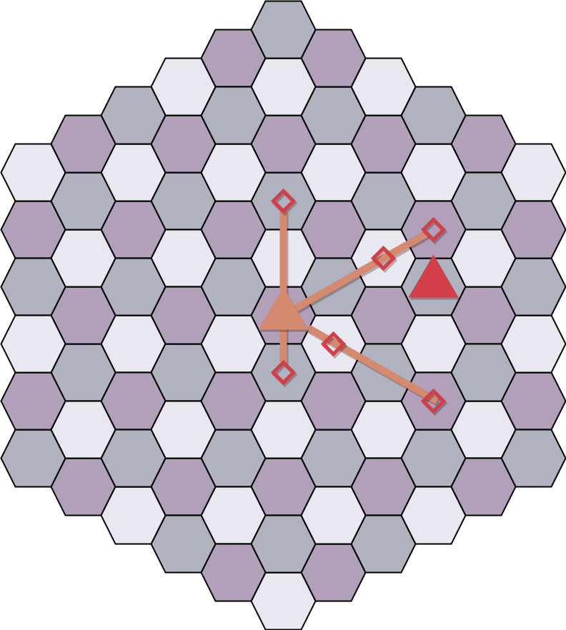
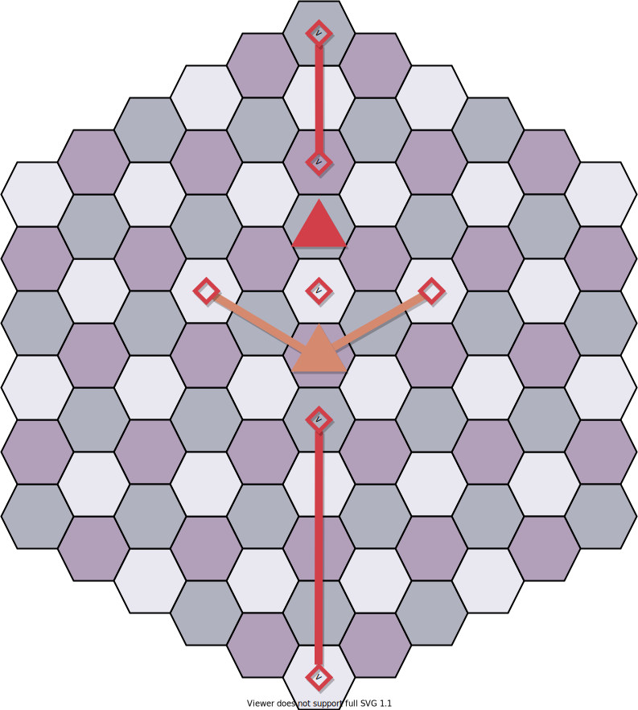

# Hexagonal Rooks

Transforming confusing input  
[The Problem](https://open.kattis.com/problems/hexagonalrooks)

## <!-- omit in toc -->Contents

- [Brute force solution](#brute-force-solution)
- [Modelling the problem](#modelling-the-problem)
- [Implementation](#implementation)
  - [Main function](#main-function)
  - [Can reach function](#can-reach-function)
  - [Transform the board](#transform-the-board)

## Brute force solution

The constraints for this problem are very small:

- Board is 11 hexagons across
- We must make exactly 2 moves

A simple solution is to find all hexagons reachable from the current position in one move, and count the number that are also reachable by the destination in one move. This can be generalized with a graph as finding all unique paths of length 2 from a source to a destination vertex.

With a rook, two hexagons are connected if they are on a straight line from each other. Notice that for a given hexagon, there are 3 axes of movement.



When the source can reach the destination in one move, the number of length 2 paths that use the connecting line is the full length of the board, minus the source and destination positions.



[back to top](#hexagonal-rooks)

## Modelling the problem

The board notation makes it unnecessarily complicated to calculate rook moves. A more suitable system would be to have 11 rows and 11 columns that run on straight lines, as opposed to the v-shaped rows given to us.


Now calculating a rook's moves becomes easy, it can:

1. Increase row, column unchanged (move up)
2. Row unchanged, increase column (move down-right)
3. Increase row, increase column (move up-right)

Of course, it can make these same moves in the opposite direction by decreasing rows/columns.

We can also visualize the hexagon on rectilinear space:

```ruby
10                    [5                    10]
9                 [4                        10]
8             [3                            10]
7         [2                                10]
6     [1                                    10]
5  [0                                       10]
4  [0                                   9]
3  [0                               8]
2  [0                           7]
1  [0                       6]
0  [0                   5]

    0   1   2   3   4   5   6   7   8   9   10
```

Two points lie on the same line in the following ways:

1. Vertically if they're in the same column
2. Horizontally if they're in the same row
3. Diagonally (up-right) if both of their differences between row and column index are the same. The difference will fall within the range of -5 to 5 and each diagonal has a unique difference.

[back to top](#hexagonal-rooks)

## Implementation

### Main function

This implementation uses adding and subtracting 5 (the halfway point) to a row/column to find the maximum and minimum index. The count is incremented whenever a point is found that both the source and destination can reach, and that is neither the source nor destination.

```ruby
# main function
LAST = 10
MID = 5
s = source position
d = destination position
count = 0

# vertical: row stays the same
for r from max(s.c - MID, 0) to min(s.c + MID, LAST)
  p.r = r
  p.c = c
  if r != s.r and can_reach(d, p)
  then count += 1

# horizontal: column stays the same
for c from max(s.r - MID, 0) to min(s.r + MID, LAST)
  p.r = r
  p.c = c
  if c != s.c and can_reach(d, p)
  then count += 1

# diagonal: row and column increase
i = s.r - s.c
origin.r = max(i, 0)
origin.c = max(-i, 0)
for delta from 0 to LEN - abs(i)
  p.r = origin.r + delta
  p.c = origin.c + delta
  if r != s.r and can_reach(d, p)
  then count += 1

return count
```

A somewhat simpler implementation is to check every position on the board.

```ruby
# main function
LAST = 10
MID = 5
s = source position
d = destination position
count = 0

for r from 0 to LAST
  for c from max(r - MID, 0) to min(r + MID, LAST)
    p.r = r
    p.c = c
    if can_reach(s, p) and can_reach(d, p)
    then count += 1

return count
```

### Can reach function

Check if two points can reach each other.

```ruby
# can_reach function
a = point a
b = point b

# can't move to same position
if a == b then return false

if a.c == b.c             # vertical: same column
or a.r == b.r             # horizontal: same row
or a.r - a.c == b.r - b.c # diagonal: same difference
then return true

# cannot reach in one move
return false
```

### Transform the board

If you look at the hexagonal board again, rows past the center column should start index 1, then 2, then 3, and so on; instead they all start at 0. We need to adjust the rows of those points upwards by how far past the center column they are.

```ruby
# transform procedure
MID = 5
r = row index
c = column index

if c > MID then r += c - MID
```

[back to top](#hexagonal-rooks)
